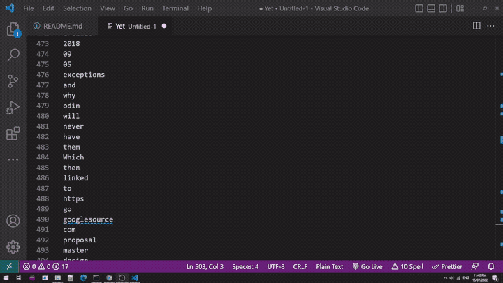
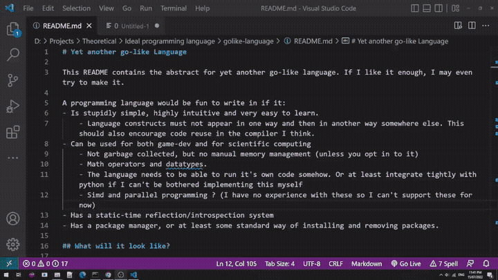
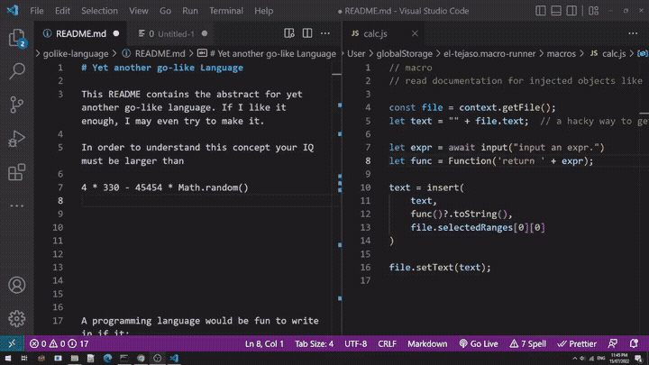

# Macro Runner

This extension provides a quick and simple way to process a text file with some quickly written Javascript.


Use the `New Macro` command from the `Ctrl+Shift+P` menu to create a new macro. The default macro template will open in a text editor to the side of whatever you're editing.

Then, write your macro. For example, here is a macro that will remove duplicate lines in a text file - something that I actually use every now and then:

```javascript
// macro: deduplicate lines
const file = context.getFile();
let text = file.text;

// let's say you wrote this real quick and didn't care for readability
text = [...new Set(text.replace(/\r/g, "").split("\n"))].join("\n");

file.setText(text);
```

(You won't have any autocomplete, but the API is fairly small and easy to remember. You can find the documentation if you keep scrolling. I have several examples in the `examples` folder in the GitHub repo as well. (Also if you happen to know an easy way I could add autocomplete, feel free to let me know))

Run it with the `Run macro` command. This will only work if you have the editor with the macro code and the editor with the target text visible at the same time.

You don't have to save your macro anywhere to be able to run it, but you can if you want to with the `Save macro` command. This allows you to load it later with the `Load macro` command. The `Delete macro` and `Open macros directory` commands also exist for macro management.

You will notice that the `Load Macro` command simply opens a macro you saved to the side of whatever you're editing. But a lot of the time, you will want to run a macro without having to call `Load Macro` and `Run Macro` and all the other stuff associated with that. You can use the `Run Saved Macro` command to run something that you have already saved.



## Limitations

The `Run Macro` command won't work for files larger than 50mb. At the moment, all VSCode extensions are [unable to interact with files > 50mb in size](https://github.com/microsoft/vscode/issues/31078), so the extension will fail at the step where it is trying to find the document you have open. You will instead have to use the `Run Macro (For large files > 50mb)` command. This is identical to the `Run Macro` command, but you will manually specify a file, and then rather than editing the file itself, it will bring the result into a new untitled document.

# Possible additional features

So it turns out that I am using this extension a lot more than even I thought I would. There are a few things that I now need to add:

-   Some way to create an output and log it somewhere. We can output text to a new file, but I would like to be able to output to the same file over and over
-   Some way to do debug logging. the vscode error messages aren't enough. Probably to a file that persists in global storage

# Known issues

Stack-overflow exceptions will be silently ignored, and will cause the edtior to crash. E.g something like this may frustrate you to no end till you notice the typo and kick yourself:

```javascript
const stringBuilder = [];

for (let i = 0; (i = file.text.length); i++) {
    stringBuilder.push(String.fromCharCode(file.text.charCodeAt(i) + cipherOffset));
}
```

# API Documentation / details

One problem with this approach to macros is that even though you will be writing far less code that is far simpler, you won't get any autocomplete for injected objects, so I have to write a bunch of documentation (sigh). There may be functions that I omit due to them being too insignificant.

## Injected objects?

Your macro is ran by using a `Function()` JavaScript object (not easy to find docs on this unless you are looking for documentation on [`eval()`](https://developer.mozilla.org/en-US/docs/Web/JavaScript/Reference/Global_Objects/eval#never_use_eval!)).
You can see what this call looks like for yourself `runmacroCommand.ts`, if that's your thing, and you will notice that some objects are being injected into it.

For those of you who didn't peer at the source code, think of it as basically looking something like this:

```javascript
const runmacro = (context, debug, ...injectedObjects) => {
    // your macro code is copy-pasted here, and has access to all the injected objects above
};
```

Except that it won't have access to global scope, because it is wrapped in a string and then compiled with a <code l='JavaScript'>Function()</code> object.

[//]: # "Anchor point"

## context : MacroContext

You will be using this object to edit the target file, and possibly create new output files.

### `context.getFile() -> EditableFile`

> Use `getFile()` to get the currently active file as an `EditableFile` object.
> I may be changing this method to accept a string, which you can use to get a file by name.

### `context.newFile(text="") -> EditableFile`

> Use `newFile()` to create a new output file as an `EditableObject` object.
> Text can be provided to set it's initial text.

### `context.rootDir:string`

> Use this to get the project root fsPath. This will fallback to the document's folder if no folder is open, and then fallback to being `undefined` if the macro is being run on an untitled file.

### `async context.outputImmediate()`

> Use `outputImmediate()` to push the current text directly to the target file immediately.
> This has no real world use other than novelty, in that it can be used along with `setInterval`/`loop` to make animations.
> There was no real reason for me to add this, or the interval method overrides, I just did it for fun.
> See the GOL example from the examples folder to see how to use:
> 

Possible additions:

-   Some way to open files in the workspace by name/glob and make changes to them

## file : EditableFile

This is the object that you will use to interface between the macro and a text file in Visual Studio..
Note that you aren't editing the actual text file, rather, you
are making changes to a normal javascript object, and the extension will see those changes and make them in the real document after the
macro is ran.

### `file.text : string`

> The text in this file. Make changes to this in your macro.

### `file.setText(newText:string)`

> Same as `file.text = newText`, but will throw an exception if the object you're passing isn't a `typeof 'string'` or `instanceof String`.
> The other functions won't do this kind of type checking (nor do I want to spend time adding it)

### `file.selectedRanges : [rangeStart: number, rangeEnd: number][]`

> The current ranges in the document that are selected.
> A range is a tuple of integers `[start, end]`, which are indices into the string.
> If you only have cursor positions instead of selections, then both `start` and `end` will be the same.
> If the range object is null, it will be ignored.

### `file.markUndoPoint()`

> Push the current value of file.text onto an array as an 'undo point'.
> The extension will then replay all of these undo points onto the target document before the final output,
> so that you can undo/redo between them - possibly for debugging purposes.

Possible additions:

-   `matchPrev(regExp)`. But making this efficient seems hard. Any PRers?

## debug : DebugContext

This object is used to log things.

### `async debug.info(message)`

> Pushes an info message notification in VS-Code

### `async debug.error(message)`

> Pushes an error message notification in VS-Code

Possible additions:

-   Breakpoints.
    They would be awesome, but I have no idea how to add them. It may require a massive rewrite, which I don't want to do.
    Ideas are welcome.

## ...javascriptUtils

These are normal javascript methods that have been directly injected, or overridden:

### `require() -> module`

> JavaScript's require function, untouched. Use it to require whatever modules you need

### `async input(prompt: string) -> Promise<string>`

> Provides a way to input arguments to your macros. You will need to use `await` with this method.
> If the input was canceled, it returns null.
> 

### `exit(reason: string)`

> Exits the program, and shows an info popup containing `reason` .
> You can technically just type `return;` to end the macro early since it's being pasted into an async Javascript function, but
> the editor does a red underline which is rightfully there but very distracting, so I added this method.

### `SetInterval(callback, milliseconds) -> NodeJS.Timeout, SetTimeout(callback, milliseconds) -> NodeJS.Timeout, ClearInterval(timeout: NodeJS.Timeout), ClearTimeout(timeout: NodeJS.Timeout),`

> These are actually wrappers for the normal javascript methods that interop better with this extension.
> It behaves exactly the same as the javascript method.

### `loop(callback(count) -> bool, milliseconds, loopCount=undefined|number)`

> A wrapper for the setInterval method that allows for a loop counter, and accepts a callback  
> that can return `true` to break out of the loop and anything else to keep looping.
> This method is a bit unstable at the moment. I am not sure why, and since I almost never use it in macros
> I may not be fixing this for quite some time

Possible additions:

-   Low priority - Keyboard input.
    Any PRers ?

## ...stringUtils

These are utility methods that make string editing much easier.

### `replaceMany(text:string, ranges: [number, number][], strings: string[]) -> [newText: string, new ranges: [number, number][]]`

> Replaces all specified ranges in the text with the corresponding string.
> Modulo will be used to loop through strings if fewer strings than ranges are provided.  
> Overlapping ranges will throw an exception.
> It then returns a tuple `[newText:string, newRanges: [number, number][]]`.
> The ranges will also be returned in sorted order based on their starting point, as this is a side-effect of checking for overlapping ranges

### `removeMany(text:string, ranges: [number, number][]) -> [newText: string, new ranges: [number, number][]]`

> Short for `replaceMany(ranges, [""])`

### `insertMany(text:string, positions: [number][], strings: string[]) -> [newText: string, new ranges: [number, number][]]`

> Short for `replaceMany(positions.map(x => [x,x]), strings)`

### `findAll(text:string, expr: RegExp | string) -> RegExpMatchArray[]`

> Short for `Array.from(file.getText.matchAll(expr))`

### `findAllPositions(text:string, expr: RegExp | string) -> number[]`

> Same as findAll but collects all match indices

### `findAllRanges(text:string, expr: RegExp | string) -> [number, number][]`

> Same as matchAllArray but collects all ranges. A range is defined as a tuple [start: number,end: number]
> where start is the start of the match (inclusive) and end is the end of a match (exclusive, 1 after the end of a match).

### `matchNext(text:string, expr: RegExp | string, position: number = 0) -> RegExpMatchArray`

> Same as JavaScript's string.indexOf, but you can use regex

### `replace(text:string, str: string, start: number, end: number)`

> Short for `file.text.substring(0, start) + str + file.text.substring(end)`

### `insert(text:string, str: string, position: number)`

> Short for `replace(str, position, position)`

### `remove(text:string, start: number, end: number)`

> Short for `replace('', start, end);`

### `indexAfter(text:string, str: string, position: number = 0)`

> Short for `text.indexOf(str, position) + str.length;`

### `lastIndexAfter(text:string, str: string, position: number = -1)`

> Same as indexOf but in the reverse direction, and 1 index after the string to remain consistent with indexAfter

Possible additions:

-   Low priority - Keyboard input.
    Any PRers ?
